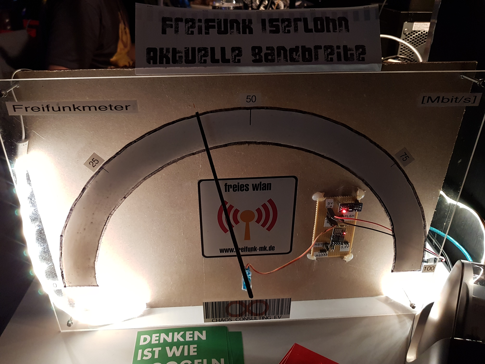

# Freifunkmeter

Ein ESP-01 mit Nodemcu Firmware zieht sich über LUA-Scripte aktuelle Trafficdaten (über vnstat) von einem Server und mapped den Durchsatz auf den per Servomotor gesteuerten Zeiger.

Die [Software](./source/) und die [Hardware](./schematic).
